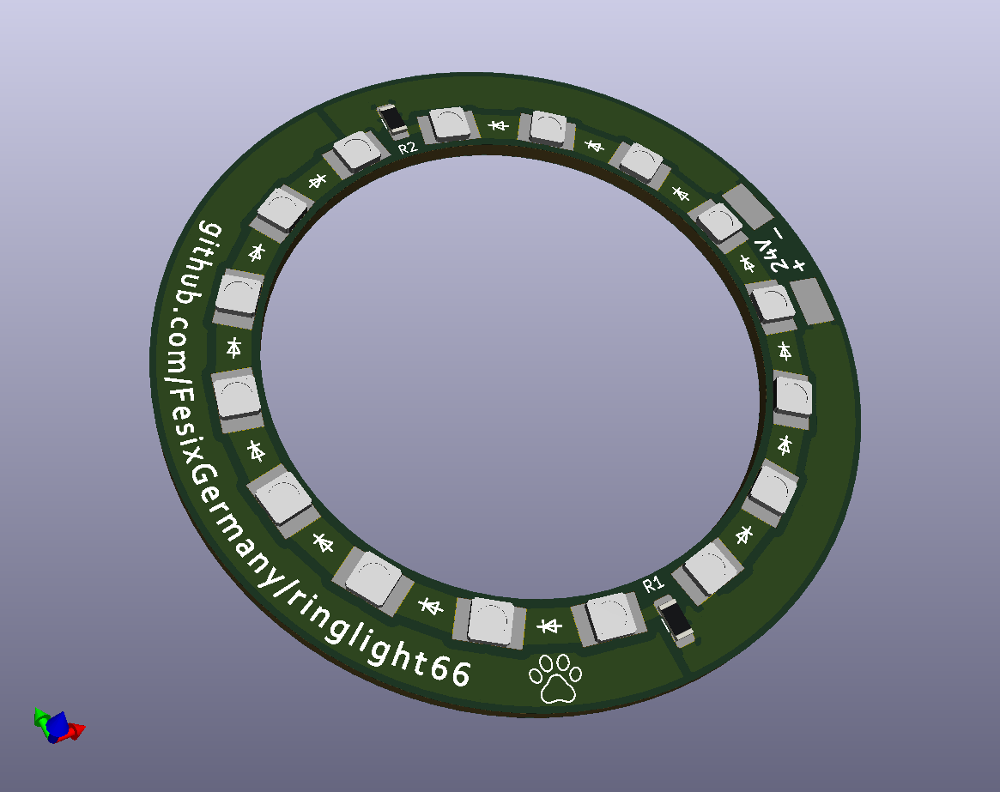

# ringlight66  

Ringlight for microscope with 16 LEDs running at 24V at 60-70mA in total (30-35mA per row of LEDs).  
Inner dia 47.2mm, outer dia 66mm.  

LEDs used are Nichia NFSW036DT which could be brighter with more current but I wanted to have more even illumination so I went with more LEDs at lower current instead of a few very bright ones at higher current. This also brings down the heat dissipation of the current limiting resistors and the LEDs.  

These LEDs are no longer available but others can be used with similar package such as PLCC-2. Forward voltage of LEDs will be different so the current limiting resistors might have to be changed.  
Also important to note is, that some LEDs have additional pads for heat dissipation in the middle. These would short the pads so such can not be used.  

